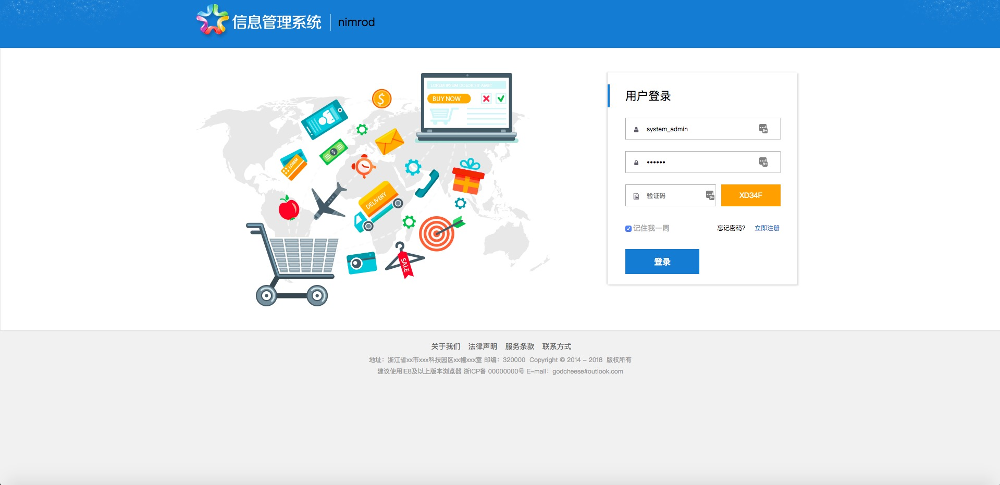
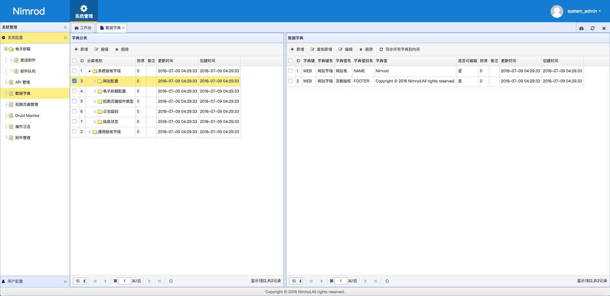
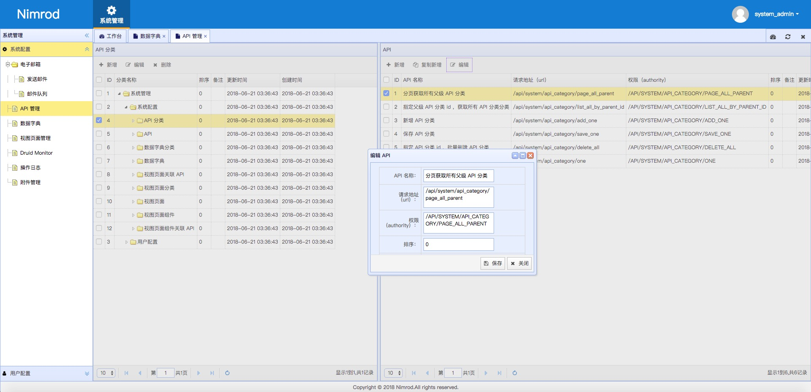

# Nimrod
- Last Updated: 2018-11-05
- 自己封装的 Java Web 平台快速开发脚手架 - Spring Boot+Spring+Spring MVC+MyBatis+Thymeleaf，遵守[阿里巴巴 Java 开发规约](https://github.com/alibaba/p3c)。
- 严格的 RBAC （ Role-Based Access Control ，基于角色的访问控制）。
- 模块化开发。

|环境  |版本|
|:-----|---|
|[Java](https://www.oracle.com/technetwork/java/javase/downloads/jdk8-downloads-2133151.html)  |1.8|
|[MySQL](https://dev.mysql.com/downloads/mysql/5.7.html#downloads) |5.7|
|[Maven](http://maven.apache.org/download.cgi) |3.5|
|[Tomcat](https://tomcat.apache.org/download-80.cgi)|8.5|

|依赖            |版本         |
|:------------- |:------------|
|[Spring Boot](http://mvnrepository.com/artifact/org.springframework.boot/spring-boot)    |2.1.0.RELEASE|
|[Spring Web MVC](http://mvnrepository.com/artifact/org.springframework/spring-webmvc)     |5.1.2.RELEASE|
|[Spring Security Web](http://mvnrepository.com/artifact/org.springframework.security/spring-security-web)|5.1.1.RELEASE|
|[MyBatis](http://mvnrepository.com/artifact/org.mybatis/mybatis)        |3.4.6      |
|[Thymeleaf](http://mvnrepository.com/artifact/org.thymeleaf/thymeleaf)      |3.0.11.RELEASE|
|[Druid](http://mvnrepository.com/artifact/com.alibaba/druid-spring-boot-starter)          |1.1.10       |

|测试账号     |        |                                       |
|:-----------|:-------|:--------------------------------------|
|Username    |Password|Role & Authority                       |
|system_admin|123456  |ROLE_USER,ROLE_ADMIN,ROLE_SYSTEM_ADMIN |
|admin       |123456  |ROLE_USER,ROLE_ADMIN,/API/SYSTEM/INDEX |
|user        |123456  |ROLE_USER                              |

## TODO
- 数据字典 ✓
- 角色管理 ✓
- 用户管理 ✓
  - 在线用户 ✗
- 权限管理 ✓
  - 视图菜单 ✓
  - 视图页面 ✓
  - 视图页面组件 ✓
  - API ✓
- 电子邮件管理（ActiveMQ） ✓
- 请求日志 ✓
- 附件管理 ✓
- 定时任务 ✗
- 部门管理 ✓
- 工作流 ✗

## [环境搭建](https://github.com/godcheese/nimrod/wiki/%E7%8E%AF%E5%A2%83%E6%90%AD%E5%BB%BA)

## Screenshots

## Changelog
- v0.2.0 2018.12.21
  - 整合 ActiveMQ
  - 新增部门管理
- v0.1.0 2018.11.05
  - 最新版发布
- v0.0.1 2018.02.22
  - 第一版发布